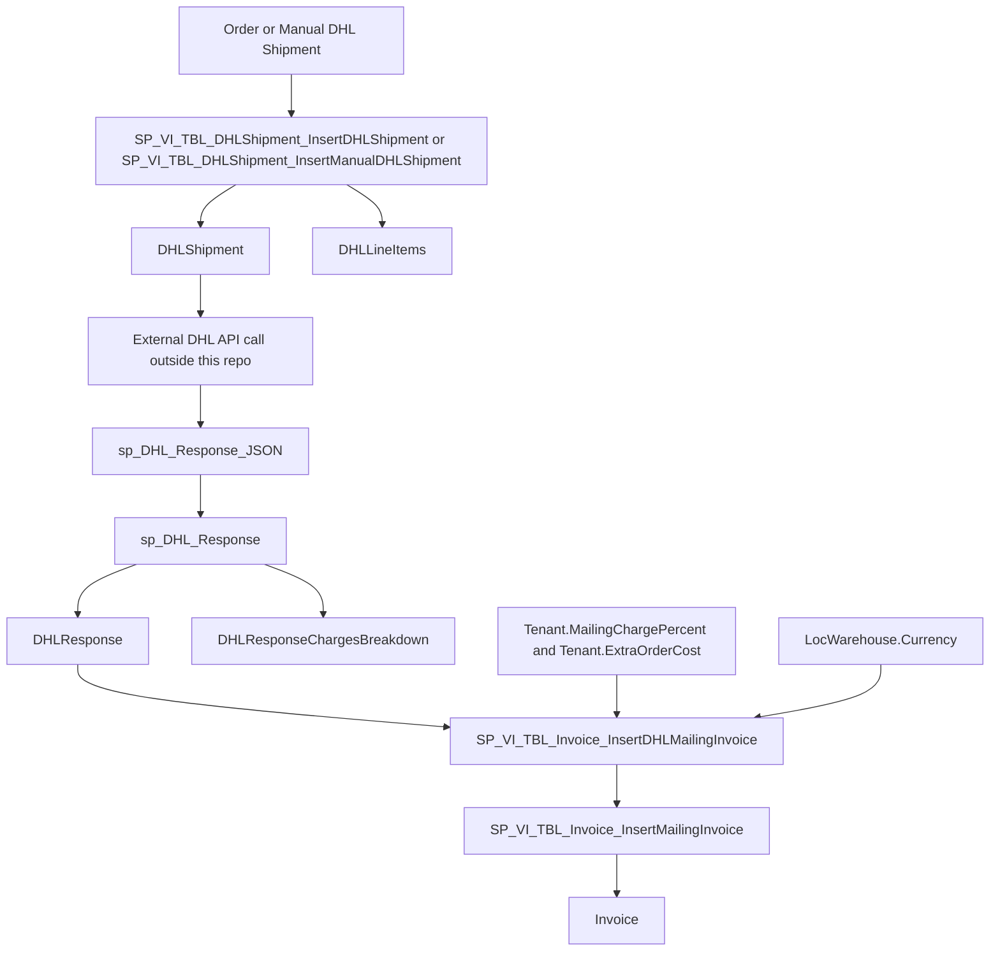

# DHL Charge Logic

## Summary

The DHL charge flow in this repository does not calculate carrier freight from shipment dimensions or item values inside SQL.

The SQL layer does three separate things:

1. Build and store DHL shipment request data.
2. Store the DHL API response total price and returned charge breakdown.
3. Create tenant invoice rows from the stored DHL total price using tenant markup settings.

## Main Formula

For DHL mailing invoices, the tenant-facing shipping charge is:

$$
\text{Final DHL Charge} = \left\lceil \text{DHLResponse.price} + \left(\text{DHLResponse.price} \times \frac{\text{Tenant.MailingChargePercent}}{100}\right) \right\rceil
$$

If `Tenant.ExtraOrderCost` is not zero, the system inserts an additional invoice row as a separate shipping-related charge.

## Example: Why Cost Can Be 75.00

In the invoice screen, a row like this:

- `Charge Name = DHL Mailing Charge`
- `Charge Type = Standard`
- `Charge Category = Shipping`
- `Cost = 75.00`

matches the non-manual DHL branch in `SP_VI_TBL_Invoice_InsertDHLMailingInvoice`.

That branch:

1. reads `DHLResponse.price` for the order reference
2. reads `Tenant.MailingChargePercent`
3. applies `CEILING(...)`
4. inserts the result into `Invoice`

The most likely numeric example is:

$$
\\text{Raw DHL Price} = 65.00
$$

$$
\\text{Markup} = 15\%
$$

$$
\\text{Computed Charge} = \left\lceil 65.00 + (65.00 \times 0.15) \right\rceil = \left\lceil 74.75 \right\rceil = 75
$$

So a displayed invoice cost of `75.00` is consistent with:

- `DHLResponse.price = 65.00`
- `Tenant.MailingChargePercent = 15`
- `ExtraOrderCost = 0` for that invoice row

The charge name `DHL Mailing Charge` is also significant. In this repo, that text is set by the non-manual branch of the DHL invoice procedure, which supports this interpretation.

Important limitation:

This repository contains schema and procedure logic, but not the live data needed to prove the exact values for a specific order reference. To confirm the exact reason for a `75.00` invoice in production, you must check:

- `DHLResponse.price`
- `Tenant.MailingChargePercent`
- `Tenant.ExtraOrderCost`

for the actual order and tenant in the database.

## End-To-End Flow

## Detailed Notes

### 1. Shipment creation stores request data, not DHL freight charges

The DHL shipment insert procedures build the shipment payload and line items.

- `dbo.SP_VI_TBL_DHLShipment_InsertDHLShipment`
- `dbo.SP_VI_TBL_DHLShipment_InsertManualDHLShipment`

Inside both procedures, `Items.ItemPrice` is used to populate declared customs values for `DHLLineItems`:

- `quantity_value = Quantity * ItemPrice`
- `content_declaredValue += quantity_value`

This is request-building logic for DHL shipment content, not tenant billing logic.

Relevant sections:

- Shipment insert: [dbo.SP_VI_TBL_DHLShipment_InsertDHLShipment.StoredProcedure.sql](../StoreProcedures/dbo.SP_VI_TBL_DHLShipment_InsertDHLShipment.StoredProcedure.sql#L718)
- Manual shipment insert: [dbo.SP_VI_TBL_DHLShipment_InsertManualDHLShipment.StoredProcedure.sql](../StoreProcedures/dbo.SP_VI_TBL_DHLShipment_InsertManualDHLShipment.StoredProcedure.sql#L685)

### 2. DHL response stores the carrier-returned total and breakdown

`dbo.sp_DHL_Response` inserts:

- the overall DHL response total into `DHLResponse.price`
- each breakdown row into `DHLResponseChargesBreakdown`

Relevant sections:

- Response proc: [dbo.sp_DHL_Response.StoredProcedure.sql](../StoreProcedures/dbo.sp_DHL_Response.StoredProcedure.sql#L25)
- Breakdown insert: [dbo.sp_DHL_Response.StoredProcedure.sql](../StoreProcedures/dbo.sp_DHL_Response.StoredProcedure.sql#L37)

The `DHLResponseChargesBreakdown` table stores:

- `name`
- `price`
- `typeCode`

Table definition:

- [dbo.DHLResponseChargesBreakdown.Table.sql](../Tables/dbo.DHLResponseChargesBreakdown.Table.sql#L8)

At the moment, this breakdown appears to be stored for audit/reference only. In this repo, I did not find downstream billing logic that reads from `DHLResponseChargesBreakdown`.

### 3. The actual DHL tenant billing logic is in the invoice procedure

`dbo.SP_VI_TBL_Invoice_InsertDHLMailingInvoice` is the main DHL charging procedure.

It does the following:

1. Resolves the relevant `WarehouseCode` and `TenantCode` for each order.
2. Reads `Currency` from `LocWarehouse`.
3. Reads `MailingChargePercent` and `ExtraOrderCost` from `Tenant`.
4. Reads the DHL carrier total from `DHLResponse.price` using `MessageReference = @OrderNumber`.
5. Applies tenant markup using `CEILING(...)`.
6. Inserts the result into the generic invoice writer proc.
7. Inserts a separate extra-cost invoice row if `ExtraOrderCost <> 0`.

Relevant sections:

- Tenant settings load: [dbo.SP_VI_TBL_Invoice_InsertDHLMailingInvoice.StoredProcedure.sql](../StoreProcedures/dbo.SP_VI_TBL_Invoice_InsertDHLMailingInvoice.StoredProcedure.sql#L106)
- Non-manual DHL charge calculation: [dbo.SP_VI_TBL_Invoice_InsertDHLMailingInvoice.StoredProcedure.sql](../StoreProcedures/dbo.SP_VI_TBL_Invoice_InsertDHLMailingInvoice.StoredProcedure.sql#L138)
- Non-manual extra order cost: [dbo.SP_VI_TBL_Invoice_InsertDHLMailingInvoice.StoredProcedure.sql](../StoreProcedures/dbo.SP_VI_TBL_Invoice_InsertDHLMailingInvoice.StoredProcedure.sql#L165)
- Manual DHL charge calculation: [dbo.SP_VI_TBL_Invoice_InsertDHLMailingInvoice.StoredProcedure.sql](../StoreProcedures/dbo.SP_VI_TBL_Invoice_InsertDHLMailingInvoice.StoredProcedure.sql#L209)
- Manual extra order cost: [dbo.SP_VI_TBL_Invoice_InsertDHLMailingInvoice.StoredProcedure.sql](../StoreProcedures/dbo.SP_VI_TBL_Invoice_InsertDHLMailingInvoice.StoredProcedure.sql#L243)

### 4. Final invoice rows are written as Shipping charges

`dbo.SP_VI_TBL_Invoice_InsertMailingInvoice` inserts into `Invoice` with:

- `ChargeCategory = 'Shipping'`
- `ChargeType = 'Standard'`
- `Qty = 1`
- `Cost = @Charge`
- `Charge = @Charge`

Relevant section:

- [dbo.SP_VI_TBL_Invoice_InsertMailingInvoice.StoredProcedure.sql](../StoreProcedures/dbo.SP_VI_TBL_Invoice_InsertMailingInvoice.StoredProcedure.sql#L57)

## Tables Involved

### Request-side tables

- `DHLShipment`
- `DHLLineItems`

### Response-side tables

- `DHLResponse`
- `DHLResponseChargesBreakdown`
- `DHLResponseDocuments`
- `DHLResponsePackages`

### Billing configuration tables

- `Tenant`
- `LocWarehouse`

### Billing output table

- `Invoice`

## Important Conclusions

1. DHL carrier pricing is not calculated in SQL from item weights, values, or package data.
2. SQL stores the price returned by DHL in `DHLResponse.price`.
3. Tenant-facing DHL billing is calculated later in `SP_VI_TBL_Invoice_InsertDHLMailingInvoice`.
4. The billing logic is based on tenant markup fields, mainly `MailingChargePercent` and `ExtraOrderCost`.
5. `DHLResponseChargesBreakdown` is persisted, but in this repo it does not appear to drive invoice creation.

## Related Schema References

- Tenant markup fields: [dbo.Tenant.Table.sql](../Tables/dbo.Tenant.Table.sql#L36)
- DHL shipment request store: [dbo.DHLShipment.Table.sql](../Tables/dbo.DHLShipment.Table.sql#L8)
- DHL response breakdown store: [dbo.DHLResponseChargesBreakdown.Table.sql](../Tables/dbo.DHLResponseChargesBreakdown.Table.sql#L8)
